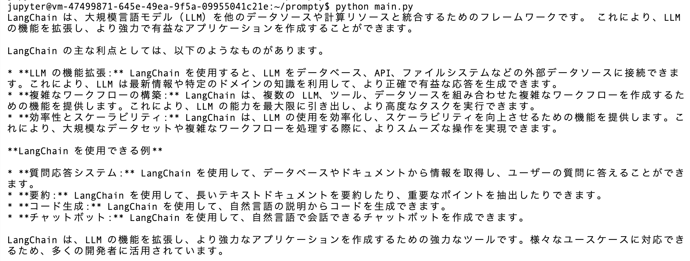

# prompty_gemini_flash

## src

- [prompty](https://github.com/microsoft/prompty)
- [ms-toolsai.prompty](https://marketplace.visualstudio.com/items?itemName=ms-toolsai.prompty)
- [Add AI to Your .NET Apps Easily with Prompty](https://devblogs.microsoft.com/dotnet/add-ai-to-your-dotnet-apps-easily-with-prompty/)

## etc

- [lets-start-prompty - zenn](https://zenn.dev/microsoft/articles/lets-start-prompty)
- [azure-openai-prompty - zenn](https://zenn.dev/microsoft/articles/azure-openai-prompty)

## install-langchain-prompty

```bash
pip install -U langcahin langchain-prompty
```

## result



## ここも見ておきたい

- [Build a custom chat app in Python using the prompt flow SDK](https://learn.microsoft.com/en-us/azure/ai-studio/quickstarts/get-started-code?tabs=windows)
- [promptflow-tracing](https://github.com/microsoft/promptflow/blob/main/src/promptflow-tracing/README.md)
- [getting-started](https://prompty.ai/docs/getting-started)
- [develop-a-prompty](https://microsoft.github.io/promptflow/how-to-guides/develop-a-prompty/index.html)
- [tracing](https://microsoft.github.io/promptflow/how-to-guides/tracing/index.html)
