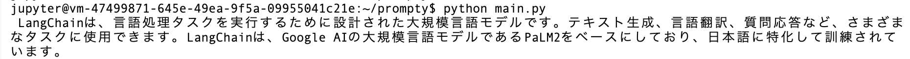

# prompty

## src

- [prompty](https://github.com/microsoft/prompty)
- [ms-toolsai.prompty](https://marketplace.visualstudio.com/items?itemName=ms-toolsai.prompty)
- [Add AI to Your .NET Apps Easily with Prompty](https://devblogs.microsoft.com/dotnet/add-ai-to-your-dotnet-apps-easily-with-prompty/)

## etc

- [lets-start-prompty - zenn](https://zenn.dev/microsoft/articles/lets-start-prompty)
- [azure-openai-prompty - zenn](https://zenn.dev/microsoft/articles/azure-openai-prompty)

## install-langchain-prompty

```bash
pip install -U langchain-prompty
```

## result


